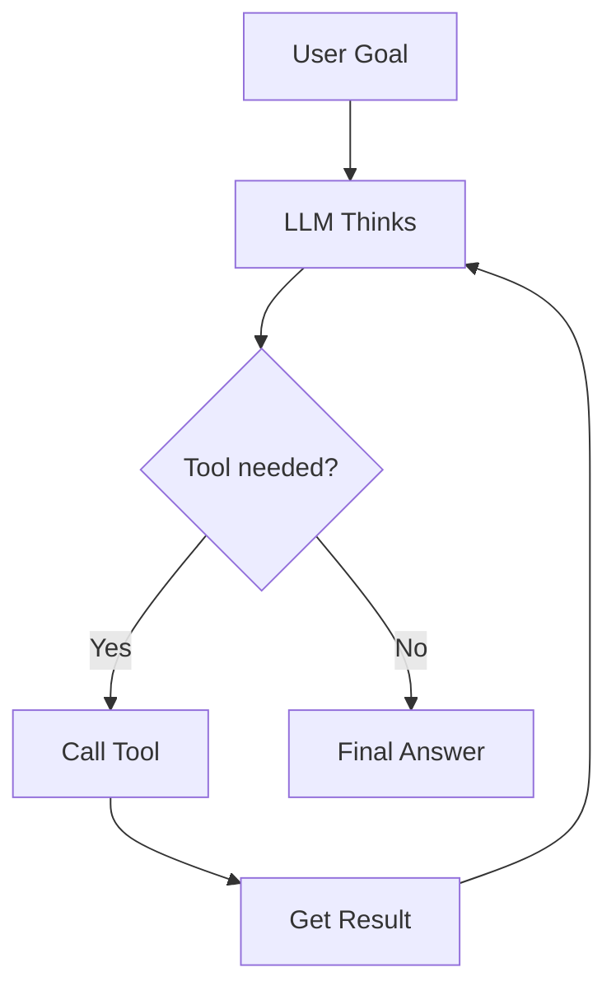
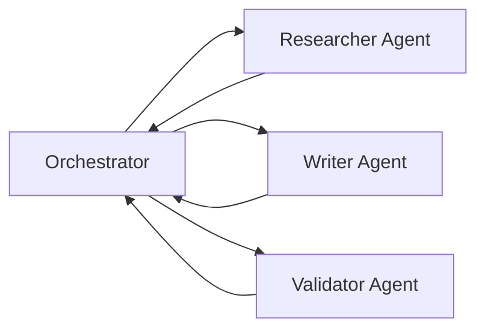

# How AI Agents Actually Work

Everyone talks about AI agents, but few explain the actual mechanics. Here's the loop that powers most of them.

## The Core Loop

At its simplest, an agent is a model running in a loop — taking observations, deciding on actions, and executing them until the goal is reached.



This loop repeats until the model decides it has enough information to respond — or hits a limit.

## Tools Are Just Functions

A tool is nothing more than a function the model can call. You describe it in natural language, the model decides when to use it, and your code runs it.

```ts
const tools = [
  {
    name: 'search_web',
    description: 'Search the web for current information',
    parameters: {
      query: { type: 'string', description: 'The search query' }
    }
  }
]
```

The model never actually "sees" the internet — it sees the return value of your function.

## Multi-Agent Systems

Once you have one agent working, you can wire agents together. One orchestrates, others specialize.



The orchestrator breaks down the goal and delegates. Each sub-agent has its own tools and context. Results flow back up.

## The Hard Part

The hard part isn't the loop — it's reliability. Models make mistakes, tools fail, context windows fill up. Production agents need:

- **Retry logic** with backoff
- **Memory** beyond the context window
- **Human-in-the-loop** for high-stakes actions
- **Structured outputs** so you can actually parse the response

The architecture is simple. Making it robust is not.
